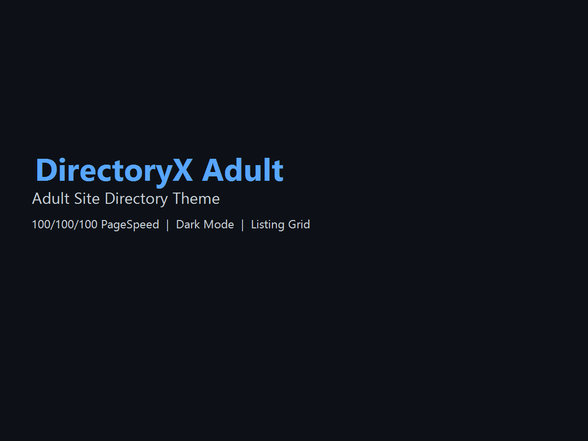

# DirectoryX Adult

A high-performance adult site directory WordPress theme built on DirectoryX. **Per-scheme full-palette design system** — each of the 8 accent schemes rewires the entire theme (background, surfaces, glass tints, text tints, mesh gradient), not just the accent color. Optimized for 100/100/100 PageSpeed.


## Features

### Design & Theming
- **Per-Scheme Full-Palette Design System** — Each of the 8 accent schemes rewires the **entire theme**: page background, surface elevations, glass tints, text tints, and the 4-stop mesh gradient. Switching from Midnight to Ruby changes the whole page to a deep wine background with red-tinted glass, red-tinted text, and a vibrant red mesh.
- **8 Accessible Color Schemes** — Midnight Blue, Emerald Green, Ruby Red, Amethyst Purple, Amber Gold, Coral Orange, Ocean Teal, Slate Indigo. All WCAG AA compliant.
- **Glassmorphic Design** — Frosted glass cards with `backdrop-filter: blur(24px) saturate(180%)`, layered shadows with inner top-edge highlight (the "glass" tell), and smooth hover animations.
- **Animated Mesh Background** — Subtle 24s drift across 4 radial gradient stops. Paused for `prefers-reduced-motion`. Zero new HTTP requests.
- **3-Stop Gradient Text** — Logo, page titles, and entry titles use a `text → accent → accent-hover` gradient via `background-clip: text`. Each scheme colors them differently.
- **Glowing Scrollbar** — Scrollbar thumb lights up to the active scheme's accent on hover (Webkit).
- **Dark/Light Mode Toggle** — Persisted in localStorage with smooth transitions. Theme toggle is the only user-facing color control.
- **100/100/100 PageSpeed** — Critical CSS inlined, deferred assets, lazy loading, zero bloat.
- **SVG Icon System** — 30+ inline SVG icons, themeable via CSS `currentColor`.
- **Scroll Progress Bar & Back-to-Top** — Floating UI helpers with reduced-motion support.

### Content & Listings
- **Custom Listing Post Type** — With URL, rating, status, **featured flag**, **view counter**, and **click counter** meta fields
- **Admin Columns & Quick Edit** — Sortable Featured, Rating, Status, URL, Views, Clicks columns; inline-edit rating/status/featured
- **Category Taxonomy** — `listing_category` with archive templates
- **Featured Listings** — Pin to top of archives with a gold badge
- **Related Listings** — Auto-shown on single listings by shared category
- **Recently Viewed** — Cookie-tracked, shown on single listings
- **Top Rated & Most Popular Templates** — Drop-in page templates for curated discovery
- **Report Listing Form** — Frontend broken / inappropriate / spam reporting with admin-post handler
- **Social Share** — X (Twitter) share + copy-link button

### Discovery & Filtering
- **Archive Filter Bar** — Sort, category, status, and min-rating selectors on `archive.php`
- **Sort Options** — Newest, Top Rated, Most Popular (by views), A–Z
- **AJAX Search** — Live dropdown with debounced input, keyboard navigation (↑/↓/Enter/Esc)
- **REST API Endpoint** — `GET /wp-json/directoryx/v1/listings` with `category`, `status`, `min_rating`, `sort`, `per_page` params
- **Click & View Tracking** — `navigator.sendBeacon` for outbound clicks, server-side view increments

### Frontend UX
- **Image Lightbox** — Fullscreen modal for listing thumbnails
- **Toast Notifications** — Bottom-center glassmorphic toasts
- **Loading Skeletons** — Shimmer placeholders for AJAX content
- **IntersectionObserver Animations** — Cards fade-in on scroll (class-driven, reduced-motion aware)
- **Instant Prefetch** — `requestIdleCallback` + `mouseover` link prefetching
- **Focus Trap** — Mobile menu traps focus; Escape closes
- **Mobile Bottom Navigation** — Fixed bottom nav with safe-area-inset support

### SEO & Social
- **Open Graph & Twitter Cards** — Auto-generated meta on singular pages
- **Canonical URLs** — `<link rel="canonical">` on all pages
- **JSON-LD Schema** — `Thing` + `AggregateRating` per listing, `BreadcrumbList` for navigation
- **Pagination rel=prev/next** — On paginated archives

### Block Editor
- **theme.json** — Gutenberg color palette (8 schemes + bg/text swatches), 8 per-scheme mesh gradients, typography scale, spacing, `appearanceTools`, `customGradient`

### Accessibility
- Skip links, ARIA labels, semantic HTML5, keyboard navigation, reduced motion support, `aria-live` search results, gradient text retains readable contrast in both light and dark mode

### Internationalization
- Full i18n support with POT file (`directoryx-adult` text domain)

### Security
- Nonces on all forms, AJAX, and quick-edit
- Hashed report IPs (`wp_hash( $ip . AUTH_SALT )`)
- Rate limiting on AJAX search (10 req/min/IP)
- HttpOnly + SameSite=Lax cookies
- Capability checks on all admin saves

## Screenshots



The screenshot shows the DirectoryX Adult theme's glassmorphic design with the default Midnight Blue color scheme in dark mode.

## Installation

1. Upload the theme folder to `/wp-content/themes/`
2. Activate the theme through **Appearance > Themes** in WordPress
3. Go to **Appearance > Customize** to set the default color scheme (the **only** place visitors can't override; they can only toggle light/dark via the theme toggle in the header)
4. Create "listing" posts and assign them to "listing_category" terms
5. (Optional) Create pages using the **Top Rated** or **Most Popular** templates for curated discovery

## PageSpeed Optimization

This theme achieves 100/100/100 out of the box by:

1. **Inlining critical CSS** — All above-the-fold styles in `assets/css/critical.css` inlined via `require()` in `header.php`
2. **Deferred non-critical CSS** — `main.css` loaded via `dxadultLoadCSS()` using `media="print"` swap pattern
3. **Deferred JavaScript** — All theme JS uses the `defer` attribute via `script_loader_tag` filter
4. **Removed bloat** — Emoji scripts, block library CSS, global styles, REST API links, oEmbed, shortlink, RSD, WLW manifest, generator tag
5. **Lazy loading** — All images use `loading="lazy"`
6. **System font stack** — Zero external font requests
7. **Pure-CSS animated mesh** — `background-position` animation, no JS or image requests
8. **`will-change` on entrance animations** — GPU-accelerated transitions, no layout thrash

## Custom Post Types & Taxonomies

The theme registers these automatically on activation:

- **Post Type:** `listing` (slug: `listing`)
- **Taxonomy:** `listing_category` (slug: `category`)

### Custom Meta Fields

| Field | Type | Description |
|-------|------|-------------|
| `listing_url` | URL | External site URL (used for "Visit Site" button and click tracking) |
| `listing_rating` | Number | 1.0 to 5.0 star rating |
| `listing_status` | String | `active`, `reviewed`, or `new` |
| `listing_featured` | Boolean | When `1`, listing is pinned to archive tops with a gold "Featured" badge |
| `listing_view_count` | Integer | Auto-incremented on single listing page views |
| `listing_click_count` | Integer | Auto-incremented when users click the outbound "Visit Site" link |
| `listing_reports` | Array | User-submitted reports (reason, details, time, hashed IP) |

## Page Templates

| Template | File | Purpose |
|----------|------|---------|
| Directory Home | `template-directory-home.php` | Featured categories + latest listings |
| Directory Categories | `template-directory-categories.php` | Full A–Z category grid |
| Top Rated | `template-top-rated.php` | Listings sorted by `listing_rating` (DESC) |
| Most Popular | `template-most-popular.php` | Listings sorted by `listing_view_count` (DESC) |
| Full Width | `template-full-width.php` | Edge-to-edge layout for landing pages |

## REST API

The theme exposes a custom REST endpoint for headless or AJAX use:

```http
GET /wp-json/directoryx/v1/listings?category=12&sort=rating&min_rating=4&per_page=20
```

**Response shape:**

```json
[
  {
    "id": 42,
    "title": "Example Site",
    "url": "https://example.com/listing/example-site/",
    "excerpt": "…",
    "thumbnail": "https://…/listing-thumb.jpg",
    "rating": 4.5,
    "status": "active",
    "featured": true
  }
]
```

**Available params:** `category` (term_id), `status` (active/reviewed/new), `min_rating` (float), `sort` (rating/popular/alpha), `per_page` (1–50, default 12).

## Design System

### Per-Scheme Full-Palette Architecture

The 8 color schemes are **not** accent-color overrides — each one is a **complete theme** that rewires the entire visual identity of the site. The same `h1` selector, the same `.listing-card`, the same `.site-title` will look completely different depending on which scheme the webmaster has selected in **Appearance → Customize → Colors**.

**Each scheme block defines ~35 design tokens**, including:

| Category | Tokens |
|----------|--------|
| **Background** | `--bg-page`, `--bg-elevated`, `--bg-overlay` |
| **Glass** | `--glass-bg`, `--glass-bg-strong`, `--glass-bg-subtle`, `--glass-border`, `--glass-border-strong` |
| **Text** | `--text-primary`, `--text-secondary`, `--text-muted`, `--text-subtle` |
| **Surfaces** | `--card-bg`, `--card-bg-strong`, `--card-border`, `--card-border-hover` |
| **Dividers** | `--divider`, `--divider-strong` |
| **Inputs** | `--input-bg`, `--input-border` |
| **Highlights** | `--highlight`, `--highlight-strong` |
| **Accent** | `--accent`, `--accent-hover`, `--accent-active`, `--accent-glow`, `--accent-glow-strong`, `--accent-soft` |
| **Mesh** | `--mesh-1`, `--mesh-2`, `--mesh-3`, `--mesh-4` |

### Color Schemes

| Scheme | Accent (Dark) | Dark BG | Accent (Light) | Light BG | Mood |
|--------|:-------------:|:-------:|:--------------:|:--------:|------|
| Midnight Blue | `#58a6ff` | `#050a1a` | `#0969da` | `#f0f4fa` | Cool, professional, deep space |
| Emerald Green | `#3fb950` | `#03140c` | `#1a7f37` | `#eaf6ee` | Natural, fresh, forest |
| Ruby Red | `#f85149` | `#1a0710` | `#cf222e` | `#faeef0` | Sensual, deep wine |
| Amethyst Purple | `#bc8cff` | `#120822` | `#8250df` | `#f4eefb` | Mystical, cosmic |
| Amber Gold | `#e3b341` | `#1a1104` | `#9a6700` | `#fbf4e0` | Luxurious, warm sunset |
| Coral Orange | `#ff7b72` | `#1d0908` | `#cf4a3a` | `#fdeee9` | Vibrant, terracotta |
| Ocean Teal | `#39d0d8` | `#021418` | `#0d7d7d` | `#e5f6f8` | Refreshing, deep sea |
| Slate Indigo | `#a5b4fc` | `#08081e` | `#6366f1` | `#eef0fb` | Refined, sophisticated |

All accent colors are WCAG AA compliant against their respective dark/light background.

### Visual Treatment

- **Animated mesh** — 4 radial gradient stops drift via `background-position` over 24s. Each scheme tints the mesh with its own color at 0.32+ opacity (visible, not subtle).
- **Gradient text** — `h1`, `.site-title`, `.page-title`, `.entry-title` use a 3-stop gradient (`text-primary` → `accent` → `accent-hover`) via `background-clip: text` + `-webkit-text-fill-color: transparent`.
- **Glowing scrollbar** (Webkit) — Thumb picks up the active scheme's accent on hover.
- **Bolder hovers** — `.listing-card:hover` lifts `-8px` and emits a 40px accent glow + 1px accent border via `mask-composite`.
- **Bolder focus rings** — 2px outline + 3px accent glow.

## File Structure

```
directoryx-adult/
├── style.css              # Theme header + base styles
├── index.php              # Ultimate fallback template
├── functions.php          # Theme setup, hooks, custom functions
├── theme.json             # Gutenberg block editor config (palette + 8 mesh gradients)
├── screenshot.png         # Theme screenshot
├── readme.txt             # WordPress.org readme
├── languages/             # .pot, .po, .mo files
├── inc/                   # PHP classes & modular includes
│   ├── svg-icons.php        # SVG icon helper functions
│   ├── template-functions.php   # Meta registration, admin columns, quick edit, view tracker
│   ├── template-tags.php    # Related listings, social share, report form, schema
│   ├── customizer.php
│   └── post-types.php
├── template-parts/          # Reusable template partials
│   ├── content.php
│   ├── content-listing-card.php
│   ├── content-category-card.php
│   ├── content-none.php
│   ├── content-page.php
│   ├── breadcrumbs.php
│   └── pagination.php
├── page-templates/          # Custom page templates
│   ├── template-directory-home.php
│   ├── template-directory-categories.php
│   ├── template-top-rated.php
│   ├── template-most-popular.php
│   └── template-full-width.php
├── assets/
│   ├── css/
│   │   ├── critical.css     # Inlined critical CSS (design system + all components)
│   │   ├── main.css         # Deferred styles
│   │   ├── editor-style.css
│   │   └── print.css
│   └── js/
│       └── main.js          # Deferred JS (search, lightbox, IO, focus trap, prefetch…)
└── AGENTS.md                # AI agent documentation
```

## Development

### Requirements

- WordPress 6.0+
- PHP 8.0+
- Node.js (optional, for CSS minification)

### SVG Icons

The theme includes 30+ inline SVG icons via `inc/svg-icons.php`. Use them in templates:

```php
<?php dxadult_icon( 'external-link', '14' ); ?>
<?php echo dxadult_get_icon( 'folder', '18', 'my-class' ); ?>
```

All icons use `currentColor` for stroke/fill, so they inherit the theme's accent color automatically.

### Adding a Color Scheme

Each scheme is a full palette, so adding one is more involved than just defining an accent. Required steps:

1. **Add the dark full-palette block** in `assets/css/critical.css`:
   ```css
   [data-scheme="myscheme"] {
       --bg-page: #…;
       --bg-elevated: #…;
       --glass-bg: rgba(…, 0.5);
       --glass-bg-strong: rgba(…, 0.74);
       --glass-bg-subtle: rgba(…, 0.32);
       --glass-border: rgba(…, 0.14);
       --glass-border-strong: rgba(…, 0.22);
       --text-primary: #…;
       --text-secondary: #…;
       --text-muted: #…;
       --text-subtle: #…;
       --card-bg: rgba(…, 0.5);
       --card-bg-strong: rgba(…, 0.75);
       --card-border: rgba(…, 0.12);
       --card-border-hover: rgba(…, 0.24);
       --divider: rgba(…, 0.12);
       --divider-strong: rgba(…, 0.2);
       --input-bg: rgba(…, 0.6);
       --input-border: rgba(…, 0.16);
       --highlight: rgba(…, 0.06);
       --highlight-strong: rgba(…, 0.14);
       --accent: #…;
       --accent-hover: #…;
       --accent-active: #…;
       --accent-glow: rgba(…, 0.4);
       --accent-glow-strong: rgba(…, 0.6);
       --accent-soft: rgba(…, 0.14);
       --mesh-1: rgba(…, 0.35);
       --mesh-2: rgba(…, 0.22);
       --mesh-3: rgba(…, 0.16);
       --mesh-4: rgba(…, 0.12);
   }
   ```
2. **Add the light-mode override** in the same file:
   ```css
   [data-theme="light"][data-scheme="myscheme"] {
       --bg-page: #…;
       --bg-elevated: #…;
       --mesh-1: rgba(…, 0.12);
       --mesh-2: rgba(…, 0.08);
       --mesh-3: rgba(…, 0.05);
       --mesh-4: rgba(…, 0.04);
       --accent: #…;
       --accent-hover: #…;
       --accent-glow: rgba(…, 0.2);
       --accent-glow-strong: rgba(…, 0.32);
       --accent-soft: rgba(…, 0.08);
   }
   ```
3. **Add a per-scheme mesh gradient** in `theme.json` under `settings.color.gradients`.
4. **Add to `inc/customizer.php`** in the `dxadult_default_scheme` choices array.
5. **Test contrast** for both dark and light modes against `--bg-page`. Aim for WCAG AA (4.5:1 for body text, 3:1 for large text).

### Adding a New Meta Field

1. Register in `inc/template-functions.php` (`dxadult_register_listing_meta()`):
   ```php
   register_post_meta( 'listing', 'my_field', array(
       'type'              => 'string',
       'single'            => true,
       'sanitize_callback' => 'sanitize_text_field',
       'auth_callback'     => function () { return current_user_can( 'edit_posts' ); },
       'show_in_rest'      => true,
   ) );
   ```
2. Add UI in `dxadult_listing_meta_box_callback()` and save in `dxadult_save_listing_meta()`.
3. Optionally add an admin column in `dxadult_listing_columns()` and `dxadult_listing_custom_column()`.
4. Display in `template-parts/content-listing-card.php` or a new template tag in `inc/template-tags.php`.

## Changelog

See [CHANGELOG.md](CHANGELOG.md) for the full release history.

### 1.2.0 — Design System Overhaul

- **Per-scheme full-palette** — Each of the 8 schemes now rewires the entire theme (bg, surfaces, glass, text, mesh), not just the accent.
- **Animated mesh background** — Subtle 24s drift across 4 radial gradient stops; reduced-motion aware.
- **3-stop gradient text** on h1, `.site-title`, `.page-title`, `.entry-title` (`text-primary` → `accent` → `accent-hover`).
- **Glowing scrollbar** (Webkit) that picks up the active scheme on hover.
- **Bolder focus rings** (2px + 3px accent glow) and **bolder card hovers** (lift + accent border + 40px glow).
- **Light-mode tinted pastels** for all 7 non-default schemes.
- **`theme.json`** updated with 8 per-scheme mesh gradients.
- **4th mesh gradient stop** (`--mesh-4`) for richer per-scheme backgrounds.

### 1.1.0 — Feature Release

- Featured listings with admin badge and archive pinning
- Admin columns + sortable + quick edit for all listing meta
- Top Rated and Most Popular page templates
- Archive filter bar (sort, category, status, min-rating) with nonce protection
- Related listings and recently-viewed on single listings
- Social share (X, copy link) and report listing form
- Image lightbox, back-to-top, scroll progress, toasts, loading skeletons
- AJAX search with keyboard navigation and rate limiting
- Click tracking via `sendBeacon` and custom REST endpoint
- Open Graph, Twitter Cards, canonical URLs, expanded JSON-LD
- `theme.json` for Gutenberg block editor
- Security hardening: hashed IPs, nonces everywhere, HttpOnly cookies
- IntersectionObserver refactored to CSS class toggle

### 1.0.0 — Initial Release

- Glassmorphic design with 8 color schemes
- Directory home page template
- Listing grid with glass cards
- Category taxonomy support
- 100/100/100 PageSpeed optimization
- Color scheme picker with localStorage persistence
- Mobile bottom navigation bar
- Schema.org structured data
- Breadcrumbs with Yoast SEO fallback
- Customizer settings
- SVG icon system
- Translation ready

## License

GPL v2 or later — [https://www.gnu.org/licenses/gpl-2.0.html](https://www.gnu.org/licenses/gpl-2.0.html)

## Contributing

We welcome contributions! Please read [CONTRIBUTING.md](CONTRIBUTING.md) for guidelines on code standards, pull requests, and the development workflow.

## Credits

- Built by [j0vis](https://github.com/j0vis)
- Based on the DirectoryX project
